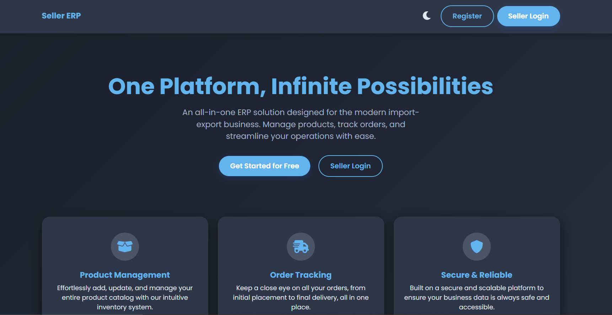
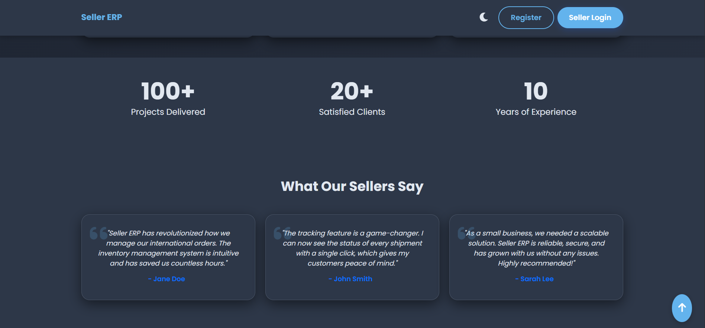
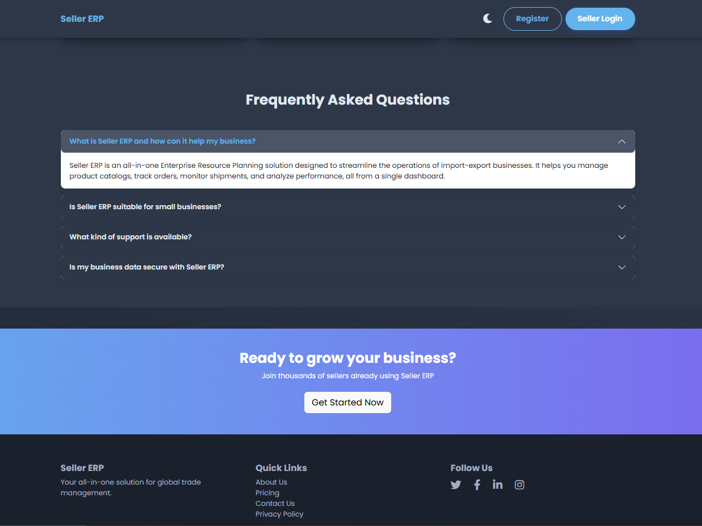
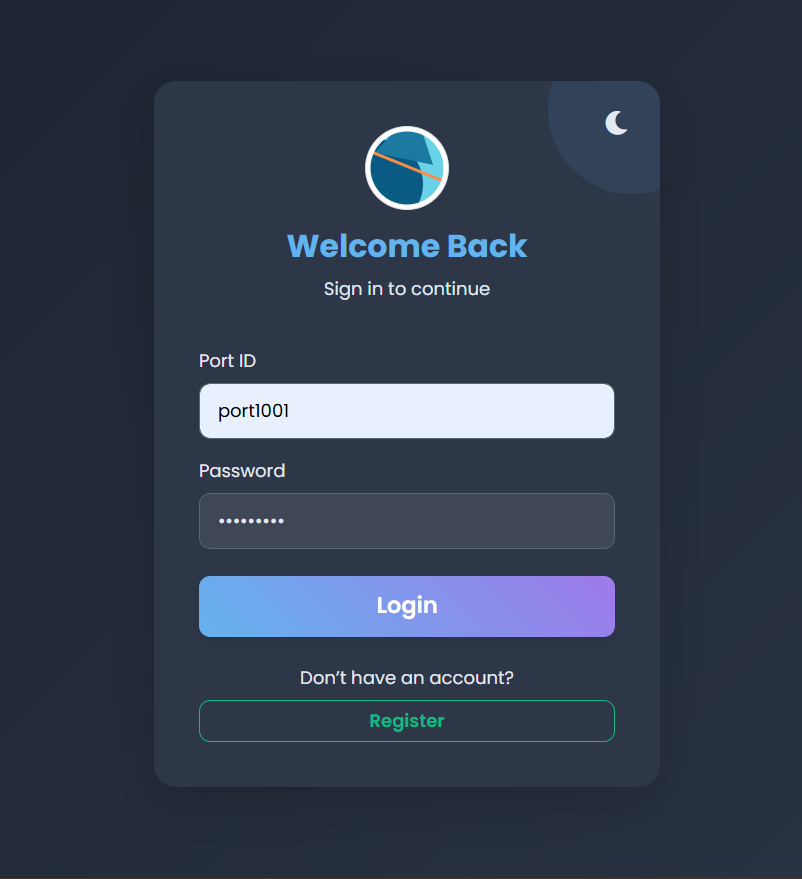
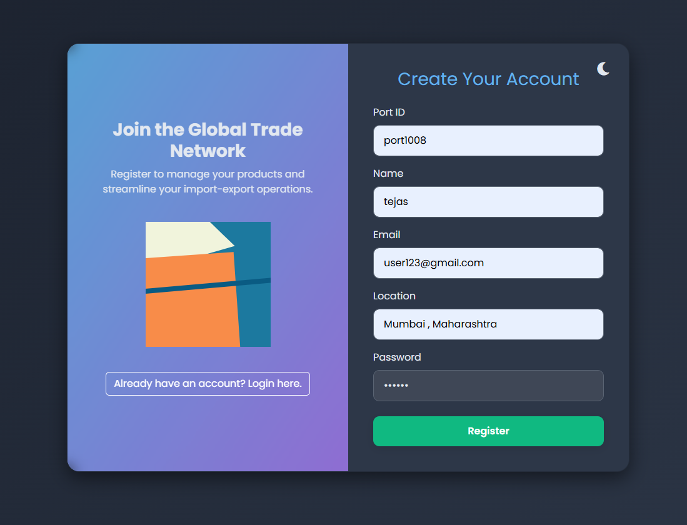
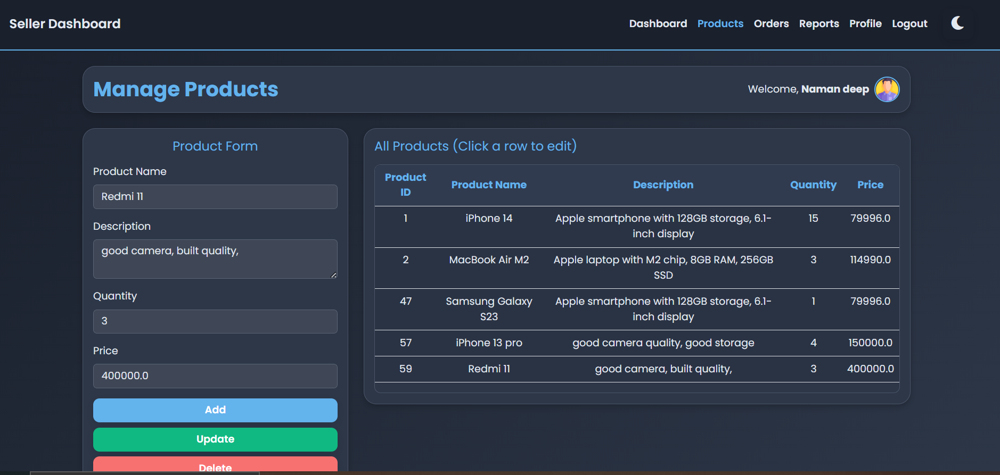
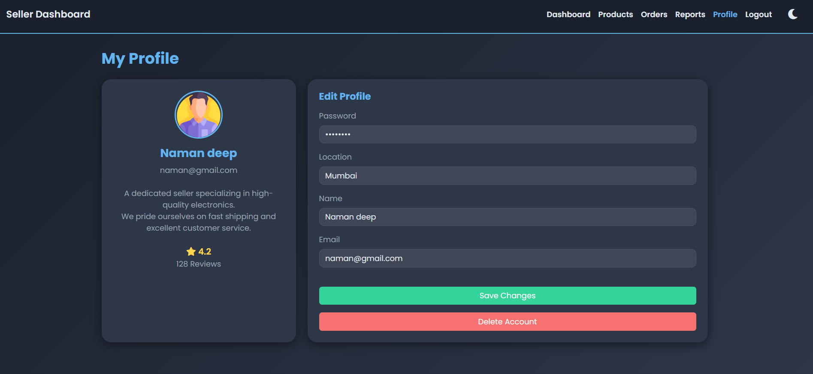

# 🧾 Seller Hub – ERP Management System

Seller Hub is a **Java-based ERP web application** designed to help sellers manage their business operations such as products, orders, reports, and profile management.  
The project is built using **JSP, Servlets, JDBC**, follows the **MVC architecture**, and runs on **Apache Tomcat 9**.

It addresses common challenges such as manual product tracking, inefficient order management, and scattered complaint handling by providing a structured, role-based ERP system built using JSP, Servlets, JDBC, and the MVC architecture.

---

## 🚀 Features

-  Secure seller Registration & Authentication
-  Full CRUD operations for product lifecycle management
-  Order tracking with real-time status updates
-  Complaint and report management system
-  Seller profile management
-  Dark mode enabled UI
-  Clean and scalable MVC architecture
-  DAO pattern for database interaction

---

## 🎥 Project Demo Video

[](https://youtu.be/vlwEM2EADyU)


---

## 🖥️ Screenshots

### 🔹 Landing Page




### 🔹 login & Register



### 🔹 Product Management


### 🔹 Order Management


### 🔹 Reports Section


### 🔹 Seller Profile


---

## 🛠 Tech Stack

| Layer | Technology |
|------|------------|
| Backend | Java, Servlets, JDBC |
| Frontend | JSP, HTML, CSS, JavaScript |
| Architecture | MVC Pattern |
| Database | MySQL |
| Server | Apache Tomcat 9.0 |
| IDE | Eclipse |

---

## 🧠 Key Technical Decisions
- Implemented MVC architecture to separate concerns and improve maintainability.
- Used DAO pattern for clean and reusable database access logic.
- Session-based authentication for secure login handling.
- Reusable JSP fragments (header/footer) for UI consistency.
- Modular structure for easier future enhancements.

## 📌 Database Design
- sellers
- products
- orders
- reports
- view profile

### Entity Relationship Diagram (ERD)

This ER diagram represents the logical database structure of the Seller Hub ERP system,
showing entities, attributes, and relationships between sellers, products, orders, and reports.


## 📁File Structure

```
🗂️CombinedProj/
├─ pom.xml
├─ Dockerfile
├─ /
📁src/
│  ├─ 📁main/
│  │  ├─ 📁java/
│  │  │  └─ com/yourcompany/combinedproj/
│  │  │      ├─ 📁dao/
│  │  │      ├─ 📁model/ 
│  │  │      └─ 📁servlet/
│  │  └─ ⚙️resources/
│  │      └─ (config files, properties, etc.)
│  └─ 📁webapp/
│      ├─ 📁WEB-INF/
│      │   ├─ web.xml
│      │   └─ lib/  (mysql.connector.jar)
│      ├─ 📁css/
│      │   └─ (CSS files)
│      ├─ 📁js/
│      │   └─ (JavaScript files)
│      ├─ 📁images/
│      │   └─ (icons images)
│      ├─ 📁shared/
│      │   └─ (common JSP fragments like header/footer)
│      └─ 📁jsp/
│          ├─ 📝index.jsp
│          ├─ 📝login.jsp
│          ├─ 📝register.jsp
│          ├─ 📝product.jsp
│          ├─ 📝order.jsp
│          ├─ 📝startDash.jsp
│          └─ 📝dashboard.jsp

```

## 📄 Software Requirement Specification (SRS)

This project was developed following a formal **Software Requirement Specification (SRS)** document.

📎 Documents:
🔹 [SRS – PDF](docs/Import_Export_Erp.pdf)


## ⚙️ Getting Started

### Prerequisites
- Java 8 or higher
- Apache Tomcat 9
- MySQL 8+
- Maven
- Eclipse / IntelliJ IDEA

## Future Enhancements
- Role-based access control (Admin / Seller / Support)
- Email & notification system
- Advanced sales analytics dashboard
- Migration to Spring Boot
- Cloud deployment (AWS / Docker)


